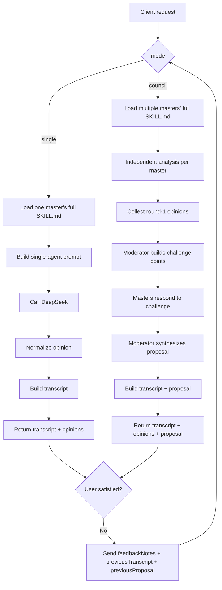

# Agent Backend Handoff

## Summary

This change adds a standalone `agent-backend/` directory at the project root for a new multi-agent investment backend. It is intentionally isolated from the existing Next.js `src/` application surface.

Current git scope:

- New directory: `agent-backend/`
- No new API routes were kept under `src/`

## Goals

The backend is designed to support:

- a single "master agent" discussion flow
- a multi-master council discussion flow
- transcript output for frontend chat rendering
- retry / re-discussion when the user is not satisfied
- runtime loading of full imported skill files instead of compressed persona summaries

## Directory Layout

```text
agent-backend/
  README.md
  deepseek.ts
  http.ts
  index.ts
  masters.ts
  orchestrator.ts
  prompts.ts
  server.ts
  skill-loader.ts
  types.ts
  utils.ts
  skills/
    THIRD_PARTY_NOTICES.md
    VIBE_INVESTING_LICENSE
    investor-personas/
      aswath-damodaran/SKILL.md
      ben-graham/SKILL.md
      bill-ackman/SKILL.md
      cathie-wood/SKILL.md
      charlie-munger/SKILL.md
      michael-burry/SKILL.md
      mohnish-pabrai/SKILL.md
      nassim-taleb/SKILL.md
      peter-lynch/SKILL.md
      phil-fisher/SKILL.md
      rakesh-jhunjhunwala/SKILL.md
      stanley-druckenmiller/SKILL.md
      warren-buffett/SKILL.md
```

## What Was Implemented

### 1. Standalone HTTP backend

The backend no longer relies on Next.js route handlers.

- Entry server: `agent-backend/server.ts`
- Request handlers: `agent-backend/http.ts`

HTTP routes:

- `GET /masters`
- `POST /discussions`

### 2. Imported full investor skills

Full `SKILL.md` files were copied from the GitHub repository:

- Source repository: `monarchjuno/vibe-investing`
- Source path: `skills/investor-personas/*/SKILL.md`

These are loaded at runtime by:

- `agent-backend/skill-loader.ts`

The backend now uses the full imported skill markdown in prompts, rather than a short in-code summary.

### 3. Master roster metadata

The file `agent-backend/masters.ts` maps internal master ids to:

- localized display names
- English names
- display style / school
- risk bias
- source GitHub URL
- imported skill slug

### 4. Single-agent flow

Implemented in:

- `agent-backend/orchestrator.ts`

Behavior:

- pick one master
- load full skill file
- build a single-agent prompt
- call DeepSeek
- normalize the structured response
- return transcript + structured opinion

### 5. Council flow

Implemented in:

- `agent-backend/orchestrator.ts`

Behavior:

- load selected masters
- each master performs independent first-round analysis
- moderator derives structured challenge points
- each master responds to one challenge round
- moderator synthesizes a final proposal
- transcript is returned for direct frontend chat rendering

### 6. Retry / user dissatisfaction loop

The request payload supports:

- `feedbackNotes`
- `previousTranscript`
- `previousProposal`

This allows the frontend to trigger a second round when the user is not satisfied with the previous result.

### 7. Fallback mode

If the model call fails or DeepSeek is unavailable:

- the backend falls back to demo opinions
- the backend can still return a transcript and proposal shell

## API Contracts

### `GET /masters`

Returns the available masters and their loaded skill content.

Example fields:

```json
{
  "masters": [
    {
      "id": "buffett",
      "skillSlug": "warren-buffett",
      "name": "沃伦·巴菲特",
      "en": "Warren Buffett",
      "school": "优质价值",
      "quote": "价格是你付出的，价值是你得到的。",
      "riskBias": "conservative",
      "publicDescription": "强调护城河、现金流、管理层与长期复利。",
      "sourceUrl": "https://github.com/monarchjuno/vibe-investing/tree/main/skills/investor-personas/warren-buffett",
      "skillName": "warren-buffett",
      "skillDescription": "Analyze an investment through Warren Buffett's long-term quality-and-value lens...",
      "skillMarkdown": "# Warren Buffett\n..."
    }
  ]
}
```

### `POST /discussions`

Supported modes:

- `single`
- `council`

Single-agent example:

```json
{
  "mode": "single",
  "masterId": "taleb",
  "question": "现在适合加仓 ETH 吗？"
}
```

Council example:

```json
{
  "mode": "council",
  "masterIds": ["buffett", "taleb", "druckenmiller"],
  "question": "请给我一个 ETH 现货和 DeFi 的三个月配置方案"
}
```

Retry example:

```json
{
  "mode": "council",
  "masterIds": ["buffett", "taleb", "druckenmiller"],
  "question": "请给我一个 ETH 现货和 DeFi 的三个月配置方案",
  "feedbackNotes": "上一轮太保守了，请明确试探仓比例，并把最大回撤讲清楚",
  "previousTranscript": [],
  "previousProposal": null
}
```

### Discussion response shape

Returned object includes:

- `mode`
- `runId`
- `masters`
- `transcript`
- `opinions`
- `proposal`
- `satisfiedPrompt`
- `demo`

## Frontend Rendering Contract

The frontend should render the returned `transcript` array in order.

Each message contains:

- `role`: `system | user | master | moderator`
- `stage`: `setup | question | analysis | challenge | rebuttal | vote | summary | feedback`
- `content`
- `masterId?`
- `masterName?`

Recommended rendering:

- `system`: centered status / notice
- `user`: user chat bubble
- `master`: master chat bubble with avatar / name
- `moderator`: moderator chat bubble or stage separator

## Mermaid Flow



## Known Gaps

The following are not done yet:

1. dedicated `package.json` inside `agent-backend/`
2. standalone backend dependency/runtime bootstrapping
3. persistent storage
4. streaming / SSE output
5. test coverage
6. end-to-end frontend integration
7. full local typecheck/lint verification in this environment

## Suggested Commit Scope

This change is a good single commit because it is self-contained:

- new standalone backend folder
- imported third-party skills
- no retained modifications to existing frontend app routes

Suggested commit message:

```text
feat: add standalone agent backend with imported investor skills
```
