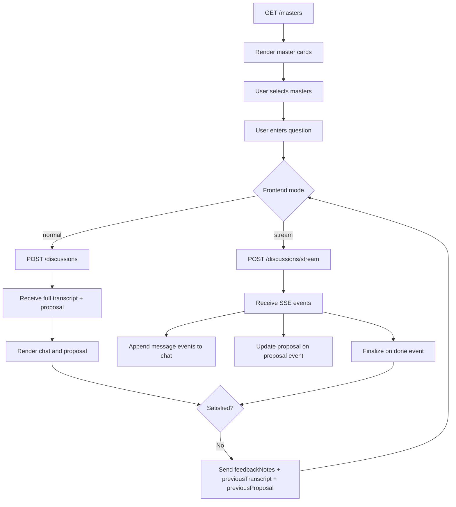

# Frontend Agent API Guide

## What This Backend Does

The standalone agent backend supports three frontend use cases:

1. load master cards for selection
2. start a single-master or council discussion
3. render discussion messages in a chat UI, either:
   - all at once
   - or incrementally through SSE

The backend lives in:

- `agent-backend/`

It is independent from the existing `src/` Next.js application routes.

## Base Endpoints

When the standalone backend server is running, the frontend should call:

- `GET /masters`
- `POST /discussions`
- `POST /discussions/stream`

## End-to-End Frontend Flow

### 1. Load master cards

On the home page:

- call `GET /masters`
- render returned masters as cards
- allow users to select one or more masters

### 2. User chooses discussion mode

- one selected master -> `single`
- two or more selected masters -> `council`

Important:

- council mode requires at least 2 valid selected masters
- unselected masters are never auto-added

### 3. User enters a question

Example:

- `请给我一个 ETH 现货和 DeFi 的三个月配置方案`

### 4. Frontend starts the discussion

Two integration options:

#### Option A: normal JSON mode

- call `POST /discussions`
- wait for one complete response
- render `transcript`
- render `proposal`

#### Option B: streaming mode

- call `POST /discussions/stream`
- read SSE events progressively
- append each `message` event to the chat UI
- update proposal when `proposal` event arrives
- finalize state when `done` arrives

### 5. User is not satisfied

If the user wants another round:

- keep the original selected masters
- keep the original question
- collect user feedback text
- send:
  - `feedbackNotes`
  - `previousTranscript`
  - `previousProposal`

The backend will start another discussion round using that feedback.

## Master Card API

### `GET /masters`

Purpose:

- render master cards on the selection page

### Response shape

```json
{
  "masters": [
    {
      "id": "buffett",
      "name": "沃伦·巴菲特",
      "en": "Warren Buffett",
      "school": "优质价值",
      "quote": "价格是你付出的，价值是你得到的。",
      "risk": "稳健",
      "uses": 42,
      "author": "monarchjuno / vibe-investing",
      "description": "Analyze an investment through Warren Buffett's long-term quality-and-value lens..."
    }
  ]
}
```

### Field meanings

- `id`
  - unique master id
- `name`
  - Chinese display name
- `en`
  - English display name
- `school`
  - investment style / school
- `quote`
  - signature quote for display
- `risk`
  - one of: `稳健`, `均衡`, `进取`
- `uses`
  - display-only popularity number
- `author`
  - current skill source / author label
- `description`
  - short framework description for the card

## Discussion API

### `POST /discussions`

Purpose:

- run the full discussion and return everything in one response

### Request: single-master

```json
{
  "mode": "single",
  "masterId": "taleb",
  "question": "现在适合加仓 ETH 吗？"
}
```

### Request: council

```json
{
  "mode": "council",
  "masterIds": ["buffett", "taleb", "druckenmiller"],
  "question": "请给我一个 ETH 现货和 DeFi 的三个月配置方案"
}
```

### Request: retry with feedback

```json
{
  "mode": "council",
  "masterIds": ["buffett", "taleb", "druckenmiller"],
  "question": "请给我一个 ETH 现货和 DeFi 的三个月配置方案",
  "feedbackNotes": "上一轮太保守了，请明确试探仓比例，并把最大回撤讲清楚",
  "previousTranscript": [],
  "previousProposal": null
}
```

### Response shape

```json
{
  "mode": "council",
  "runId": "run_xxx",
  "masters": [],
  "transcript": [],
  "opinions": [],
  "proposal": {},
  "satisfiedPrompt": "如果不满意，请带着修改意见重新发起同一议题，委员会会根据你的反馈重开一轮讨论。",
  "demo": false
}
```

### Important fields

- `masters`
  - the actual participating masters for this run
- `transcript`
  - ordered chat messages for the frontend chat UI
- `opinions`
  - structured per-master outputs
- `proposal`
  - final council proposal, or `null` for single mode
- `satisfiedPrompt`
  - text prompt shown when asking the user whether to redo the discussion
- `demo`
  - `true` if any stage used fallback/demo output

## Transcript Rendering Contract

The frontend chat UI should render `transcript` in order.

### Transcript item

```json
{
  "id": "analysis_xxx",
  "role": "master",
  "stage": "analysis",
  "content": "从巴菲特视角看……",
  "masterId": "buffett",
  "masterName": "沃伦·巴菲特"
}
```

### `role`

- `system`
- `user`
- `master`
- `moderator`

### `stage`

- `setup`
- `question`
- `analysis`
- `challenge`
- `rebuttal`
- `vote`
- `summary`
- `feedback`

### Recommended chat rendering

- `system`
  - centered notice / status bar
- `user`
  - right-side user bubble
- `master`
  - left-side master bubble with avatar/name
- `moderator`
  - special moderator bubble or stage divider

## Streaming Discussion API

### `POST /discussions/stream`

Purpose:

- stream the discussion to the frontend incrementally

The request body is the same as `POST /discussions`.

### Returned event types

- `meta`
- `message`
- `opinion`
- `proposal`
- `done`

### Event payload examples

#### `meta`

```json
{
  "mode": "council",
  "runId": "run_xxx",
  "masters": []
}
```

#### `message`

```json
{
  "id": "analysis_xxx",
  "role": "master",
  "stage": "analysis",
  "content": "从塔勒布视角看……",
  "masterId": "taleb",
  "masterName": "纳西姆·塔勒布"
}
```

#### `proposal`

```json
{
  "title": "委员会观察方案",
  "thesis": "……",
  "allocations": [],
  "riskLevel": "均衡",
  "expectedReturn": "不适用",
  "maxDrawdown": "优先控制在用户可承受范围内",
  "dissent": "……",
  "userConfirmationsRequired": [],
  "executionSteps": []
}
```

#### `done`

The final `done` event contains the same full object shape as `POST /discussions`.

## Recommended Frontend State

```ts
type MasterCard = {
  id: string;
  name: string;
  en: string;
  school: string;
  quote: string;
  risk: "稳健" | "均衡" | "进取";
  uses: number;
  author: string;
  description: string;
};

type DiscussionPageState = {
  selectedIds: string[];
  question: string;
  messages: TranscriptMessage[];
  proposal: CouncilProposal | null;
  feedbackNotes: string;
  loading: boolean;
  streaming: boolean;
  demo: boolean;
};
```

## Suggested Frontend UI Structure

### Home / selection page

- master card grid
- selected count
- question input
- start button

### Chat page

- selected masters header
- transcript chat list
- proposal card
- feedback input
- retry button

## Mermaid Flow



## Practical Recommendation

For the first frontend integration:

1. implement `GET /masters`
2. implement `POST /discussions`
3. render transcript in a normal chat UI
4. add retry flow

Then add streaming mode as an enhancement:

5. implement `POST /discussions/stream`
6. switch chat UI to append live messages during demos
